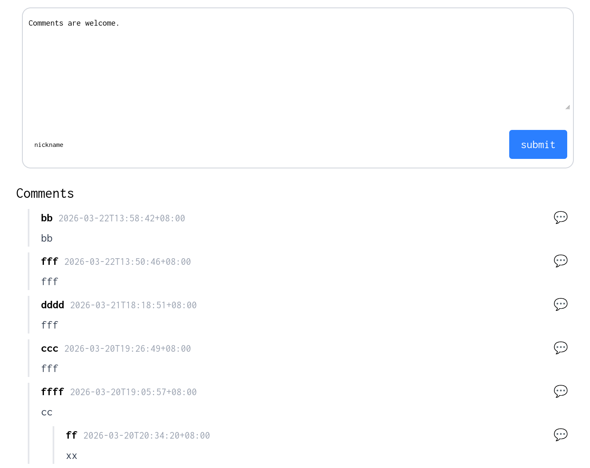

A *tiny* and *anonymous discussion* plugin implemented using Rust.

#+Caption: screent shot of en

* features

- tiny
- anonymous
- i18n: en/zh-CN supported

* usage 

** build

the output:
- frontend files: tinydis.js/tinydis.css/tindydis_bg.wasm
- backend binary executable file: tinydis

#+begin_src bash
  cargo install --locked cargo-leptos
  cargo leptos build --release && mv target/site/assets/tinydis.wasm  target/site/assets/tinydis_bg.wasm
  rm -rf ./target/site/assets/*.ts
  cp -r ./target/site/assets YOUR_SITE_ROOT_PATH
#+end_src

** start backend server

- read/write comments to the sqlite db
- send comments and clickable reject/approve links to admin email for review

#+begin_src bash
  export TINYDIS_SMTP_USERNAME=your_email_to_send_review_message
  export TINYDIS_SMTP_PASSWORD=your_password_to_send_review_message   # an App password is prefered to regular parssword
  export TINYDIS_SMTP_HOST=your_smtp_host
  export TINYDIS_SMTP_PORT=your_smtp_port
  export TINYDIS_ADMIN_EMAIL=admin_email_to_receive_review_message
  export TINYDIS_ADMIN_LOCALE=en # en/zh-CN supported now, if not set, use en
  export TINYDIS_ALLOWED_ORIGINS="*" # ALLOWED ORIGIN for backend server, such as "http://127.0.0.1:8080,http://127.0.0.1:9999" or "*" for test

  ./PATH_OF_tinydis
#+end_src

** import tinydis in frontend

Html import

TINYDIS_SERVER_ADDR ~ http:​//​your_domain_or_ip:3000

#+begin_src html
  <head>
    <!-- ... -->
    <link rel="stylesheet" href="/assets/tinydis.css" />
    <!-- ... -->
  </head>    

  <body>
    <!-- ... -->
    

    
  </body>
#+end_src

Or you can explictly set data-page-id (note: if data-page-id is not provided, the url of current page is used as data-page-id)
#+begin_src html
  

  
#+end_src

* developement

i18n:
- use leptos_i18n in Component, which get locale from browser
- use rust_i18n get local from env, such as TINYDIS_ADMIN_LOCALE  

* todo

- deploy test in production env? https? port map?
- wasm.gz? 
- better display

* reference

- [[https://github.com/leptos-rs/leptos][leptos]]
